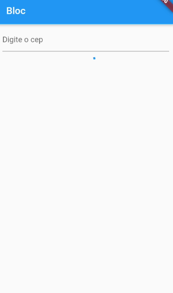
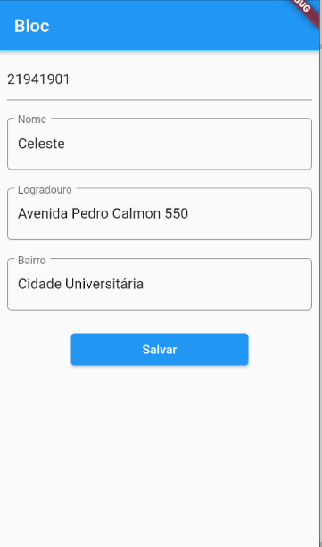

# my_project

Um projeto de teste e desenvolvimento de funcionalidades. 
A test project and functionality developemnt.

## Getting Started
##Descrição/Description

    
    

##Desenvolvimento/Development
- [x] Tela de Busca / Search Screen
- [x] Requisição de API externa / API request using an external reference
- [x] Gerência de estado com o Bloc puro / State management using Bloc
- [x] Salvar dados no Firebase / Save data in a Cloud Database

##Aprendizado
- StreamController como um recebedor de dados sendo ele também disposado ao fim do seu uso.
- Dispose dos controllers e do bloc no dispose da HomePage
- Salvar dados no banco em nuvem
- Gerenciar a reatividade/estados através do bloc e gerenciar a entrada e saída de dados por meio do input, output e StreamController.
- Uso da StreamBuilder
- Importância dos controllers na StreamBuilder como forma de mostrar os valores nos campos

 

##Próximos Passos
- Shared Preferences para salvar dados do cadastro no formulário / Shared Preferences to save form data 
- Tela de Login / Login Screen
- Autenticação / Autentication
- Refatoração de código / Code Refactoring

- [Lab: Write your first Flutter app](https://flutter.dev/docs/get-started/codelab)
- [Cookbook: Useful Flutter samples](https://flutter.dev/docs/cookbook)

For help getting started with Flutter, view our
[online documentation](https://flutter.dev/docs), which offers tutorials,
samples, guidance on mobile development, and a full API reference.
